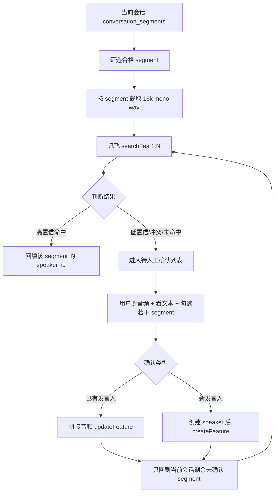

# 科大讯飞声纹识别接入方案：Segment 级身份确认 MVP

## 目标

用科大讯飞声纹识别接口替代当前不稳定的“本地聚类优先”流程，先在单个当前会话内验证闭环：

1. 直接以 `conversation_segments` 为最小识别单元。
2. 合格 segment 截音频后调用讯飞 1:N 声纹库检索。
3. 高置信命中则只回填该 segment 的发言人身份。
4. 未命中、低置信、冲突的 segment 进入人工确认。
5. 用户人工选择若干 segment，确认属于同一个发言人。
6. 将这些确认后的 segment 音频拼接为小于 4M 的讯飞注册音频，创建或更新声纹特征。
7. 新声纹注册成功后，只回刷当前会话中仍未确认的 segment，验证能否减少人工确认量。

本 MVP 不做跨会话回刷，不做全库重算，不依赖原始 `speaker_label` 自动分组。

## 核心判断

### 为什么使用 `conversation_segments`

`conversation_segments` 已经是 Soniox diarization 和转写后的结果，具有：

- `start_ms` / `end_ms`：可直接截取对应音频。
- `text`：可供后台人工确认。
- `speaker_label`：仅作为原始参考，不作为身份依据。
- `speaker_id` / `speaker_name` / `speaker_identity` / `confidence` / `resolution_method`：可直接承载最终身份结果。

### 不再前置本地聚类

本地聚类目前不稳定，可能把同一个人拆成多个候选，也可能把不同人合并。新的 MVP 中，本地聚类不参与身份判断。每条 segment 单独识别，错误只影响单条 segment，不会批量污染候选发言人。

### 不自动合并展示

系统不需要把多个 segment 自动合并展示为一个候选人。只有用户人工选择多个 segment 并确认它们属于同一人后，它们才会作为同一个发言人的注册材料。

## 讯飞能力使用方式

使用讯飞声纹识别接口的声纹库能力：

- `createGroup`：初始化远端声纹库。
- `createFeature`：为新发言人注册声纹特征。
- `updateFeature`：用人工确认后的音频更新已有发言人特征。
- `searchFea`：对单条 segment 音频做 1:N 声纹检索。
- `searchScoreFea`：可选，用于人工确认后的 1:1 校验或调试。
- `queryFeatureList`：管理和排查远端声纹库。

音频处理约束：

- 输出 `16kHz / 16bit / mono wav`。
- base64 后小于讯飞限制，注册音频控制在 4M 以下。
- 太短 segment 不调用讯飞，建议最小有效语音时长 `2500ms` 或 `3000ms`。
- 太长 segment 截取其中一段质量较稳定的音频，建议 `3-8s`。

## 数据流



## 数据库设计

### 复用现有表

#### `conversation_segments`

保留现有字段，作为最终业务结果承载层：

| 字段 | 含义 |
|---|---|
| `speaker_label` | Soniox 原始发言人标签，只做审计参考 |
| `original_speaker_label` | 原始标签备份，禁止用作身份主键 |
| `speaker_id` | 最终确认或自动命中的本地发言人 ID |
| `speaker_name` | 最终展示姓名 |
| `speaker_identity` | 发言人身份说明 |
| `confidence` | 本次身份判断置信度 |
| `resolution_method` | 身份来源，例如 `xfyun_segment_hit`、`human_segment_confirmed` |

注意：`speaker_label` 不应被修改，也不应被作为跨 segment 合并依据。

#### `speakers`

继续作为本地正式发言人表：

| 字段 | 含义 |
|---|---|
| `id` | 本地 speaker ID |
| `name` | 人工确认姓名 |
| `identity_label` | 身份描述 |
| `status` | `confirmed` 表示可参与讯飞声纹库匹配 |

### 新增表

#### `speaker_voiceprint_features`

保存本地 speaker 与讯飞远端声纹特征的映射。

```sql
CREATE TABLE IF NOT EXISTS speaker_voiceprint_features (
  id TEXT PRIMARY KEY,
  speaker_id TEXT NOT NULL,
  provider TEXT NOT NULL,
  group_id TEXT NOT NULL,
  feature_id TEXT NOT NULL,
  feature_version INTEGER NOT NULL DEFAULT 1,
  status TEXT NOT NULL DEFAULT 'active',
  source_enrollment_batch_id TEXT,
  created_at TEXT NOT NULL,
  updated_at TEXT NOT NULL,
  UNIQUE(provider, group_id, feature_id)
);
```

字段说明：

| 字段 | 含义 |
|---|---|
| `provider` | 固定为 `xfyun`，为后续腾讯云等 provider 预留 |
| `group_id` | 讯飞声纹库 ID |
| `feature_id` | 讯飞返回或本地指定的 feature ID |
| `feature_version` | 每次更新声纹特征递增 |
| `status` | `active`、`replaced`、`disabled`、`deleted` |
| `source_enrollment_batch_id` | 由哪次人工确认批次生成 |

#### `segment_voiceprint_matches`

记录每条 segment 调讯飞后的匹配结果和审计信息。

```sql
CREATE TABLE IF NOT EXISTS segment_voiceprint_matches (
  id TEXT PRIMARY KEY,
  conversation_id TEXT NOT NULL,
  segment_id TEXT NOT NULL,
  provider TEXT NOT NULL,
  group_id TEXT,
  request_audio_path TEXT,
  request_duration_ms INTEGER,
  top_feature_id TEXT,
  top_speaker_id TEXT,
  top_score REAL,
  second_feature_id TEXT,
  second_speaker_id TEXT,
  second_score REAL,
  decision TEXT NOT NULL,
  raw_response_json TEXT,
  error_message TEXT,
  created_at TEXT NOT NULL
);
```

字段说明：

| 字段 | 含义 |
|---|---|
| `segment_id` | 被识别的 `conversation_segments.id` |
| `request_audio_path` | 实际传给讯飞前的本地 wav 文件路径 |
| `top_score` | 讯飞 top1 分数 |
| `second_score` | 讯飞 top2 分数 |
| `decision` | `hit`、`low_confidence`、`conflict`、`no_match`、`skipped`、`error` |
| `raw_response_json` | 讯飞原始响应，便于后续调阈值 |

建议索引：

```sql
CREATE INDEX IF NOT EXISTS idx_segment_voiceprint_matches_segment_id
  ON segment_voiceprint_matches(segment_id);

CREATE INDEX IF NOT EXISTS idx_segment_voiceprint_matches_conversation_id
  ON segment_voiceprint_matches(conversation_id);

CREATE INDEX IF NOT EXISTS idx_segment_voiceprint_matches_decision
  ON segment_voiceprint_matches(decision);
```

#### `speaker_enrollment_batches`

记录一次人工确认并注册或更新声纹的批次。

```sql
CREATE TABLE IF NOT EXISTS speaker_enrollment_batches (
  id TEXT PRIMARY KEY,
  speaker_id TEXT NOT NULL,
  provider TEXT NOT NULL,
  group_id TEXT NOT NULL,
  feature_id TEXT,
  action TEXT NOT NULL,
  status TEXT NOT NULL,
  audio_path TEXT,
  duration_ms INTEGER,
  audio_size_bytes INTEGER,
  error_message TEXT,
  created_at TEXT NOT NULL,
  updated_at TEXT NOT NULL
);
```

字段说明：

| 字段 | 含义 |
|---|---|
| `action` | `create_feature` 或 `update_feature` |
| `status` | `pending`、`success`、`failed` |
| `audio_path` | 拼接后的注册音频 |
| `duration_ms` | 注册音频总时长 |
| `audio_size_bytes` | 注册音频大小，必须小于讯飞限制 |

#### `speaker_enrollment_segments`

记录一个注册批次使用了哪些人工确认 segment。

```sql
CREATE TABLE IF NOT EXISTS speaker_enrollment_segments (
  enrollment_batch_id TEXT NOT NULL,
  segment_id TEXT NOT NULL,
  decision TEXT NOT NULL DEFAULT 'keep',
  created_at TEXT NOT NULL,
  PRIMARY KEY(enrollment_batch_id, segment_id)
);
```

## 状态设计

### `conversation_segments.resolution_method`

| 状态 | 含义 |
|---|---|
| `xfyun_segment_hit` | segment 级调用讯飞后高置信命中 |
| `xfyun_current_conversation_backfill_hit` | 人工注册声纹后，只在当前会话回刷命中 |
| `human_segment_confirmed` | 用户人工确认该 segment 属于某 speaker |
| `human_segment_excluded` | 用户排除该 segment，不用于注册 |
| `xfyun_low_confidence` | 讯飞 top1 分数不足，未自动绑定 |
| `xfyun_conflict` | top1/top2 分数差距太小，未自动绑定 |
| `xfyun_no_match` | 未匹配到可用 speaker |
| `xfyun_skipped_short` | segment 太短，未调用讯飞 |
| `xfyun_error` | 调用讯飞失败 |

### 自动命中判断

建议先用保守阈值，实际阈值通过当前会话人工验证后调整：

| 条件 | 结果 |
|---|---|
| `top_score >= XFYUN_HIT_SCORE_THRESHOLD` 且 `top_score - second_score >= XFYUN_HIT_MARGIN` | 自动命中 |
| `top_score >= XFYUN_HIT_SCORE_THRESHOLD` 但 margin 不够 | 冲突 |
| `top_score < XFYUN_HIT_SCORE_THRESHOLD` | 低置信 |
| 无结果 | 未命中 |

阈值应配置化：

```env
XFYUN_VOICEPRINT_ENABLED=true
XFYUN_APP_ID=
XFYUN_API_KEY=
XFYUN_API_SECRET=
XFYUN_GROUP_ID=
XFYUN_HIT_SCORE_THRESHOLD=80
XFYUN_HIT_MARGIN=8
XFYUN_MIN_SEGMENT_MS=3000
XFYUN_MAX_QUERY_MS=8000
XFYUN_MAX_ENROLLMENT_BYTES=4000000
```

具体分数阈值必须用真实会话测试后校准，不应直接硬编码为最终标准。

## 后端接口设计

### 1. 当前会话 segment 级讯飞匹配

```http
POST /api/admin/conversations/:conversationId/voiceprint/xfyun/scan
```

请求：

```json
{
  "onlyUnresolved": true,
  "limit": 100,
  "dryRun": false
}
```

行为：

1. 读取该会话 `conversation_segments`。
2. 只处理未确认 segment，或按请求处理全部。
3. 过滤太短、无文本、无音频的 segment。
4. 截取合格 segment 音频并转成讯飞要求格式。
5. 调用 `searchFea`。
6. 写入 `segment_voiceprint_matches`。
7. 高置信命中时更新该条 `conversation_segments`。

不会创建新 speaker，不会自动合并 segment。

### 2. 查询当前会话待确认 segment

```http
GET /api/admin/conversations/:conversationId/voiceprint/pending-segments
```

返回：

```json
{
  "segments": [
    {
      "segmentId": "seg_xxx",
      "startMs": 12345,
      "endMs": 17890,
      "text": "这是一段转写文本",
      "audioUrl": "/media/...",
      "speakerLabel": "1",
      "decision": "xfyun_no_match",
      "topScore": 62.3,
      "secondScore": 58.1
    }
  ]
}
```

### 3. 人工确认 segment 并注册或更新声纹

```http
POST /api/admin/voiceprint/xfyun/enroll-from-segments
```

请求：

```json
{
  "conversationId": "conv_xxx",
  "segmentIds": ["seg_a", "seg_b", "seg_c"],
  "speakerMode": "new",
  "speakerId": null,
  "speakerName": "张三",
  "identityLabel": "客户",
  "excludedSegmentIds": []
}
```

或绑定已有发言人：

```json
{
  "conversationId": "conv_xxx",
  "segmentIds": ["seg_a", "seg_b"],
  "speakerMode": "existing",
  "speakerId": "spk_xxx"
}
```

行为：

1. 校验所有 segment 属于当前会话。
2. 只使用用户明确选择的 segment。
3. 截取并拼接音频，生成小于 4M 的 `16k/16bit/mono wav`。
4. 新 speaker 调 `createFeature`，已有 speaker 调 `updateFeature`。
5. 写入 `speaker_enrollment_batches`、`speaker_enrollment_segments`、`speaker_voiceprint_features`。
6. 将这些人工确认 segment 更新为目标 speaker，`resolution_method='human_segment_confirmed'`。

### 4. 当前会话回刷

```http
POST /api/admin/conversations/:conversationId/voiceprint/xfyun/backfill
```

请求：

```json
{
  "onlyUnresolved": true,
  "limit": 100
}
```

行为：

1. 只扫描当前会话仍未确认的 segment。
2. 重新调用 `searchFea`。
3. 新注册的 feature 如果能高置信命中，则更新该 segment。
4. 不跨会话，不处理历史全库。

## 管理后台设计

在现有“发言人确认”页中新增“讯飞 Segment 确认”区域。

### 页面元素

1. 当前会话选择器。
2. “扫描当前会话”按钮。
3. 待确认 segment 列表。
4. 每条 segment 展示：
   - 文本内容。
   - 音频播放器。
   - 时间范围。
   - 原始 `speaker_label`，仅标注为“原始标签”。
   - 讯飞 top1/top2 分数。
   - 当前状态。
5. 批量选择框。
6. 操作区：
   - 确认为已有发言人。
   - 创建新发言人并注册声纹。
   - 排除所选 segment。
7. “回刷当前会话未确认 segment”按钮。
8. 当前会话统计：
   - 总 segment 数。
   - 已自动命中数。
   - 人工确认数。
   - 未确认数。
   - 跳过太短数。
   - 错误数。

### 交互原则

- 用户确认前，系统不创建新 speaker。
- 用户确认前，系统不把多个 segment 自动归为同一个人。
- 用户可以听音频、看文本后决定哪些 segment 属于同一个人。
- 排除的 segment 不用于声纹注册。
- 回刷只作用于当前会话。

## 实现步骤

### Phase 1：讯飞 provider 封装

新增服务建议：

```text
src/services/voiceprint/xfyun-client.ts
src/services/voiceprint/audio-prep.ts
src/services/voiceprint/segment-voiceprint-service.ts
```

能力：

- 生成讯飞鉴权参数。
- 调用 `searchFea`、`createFeature`、`updateFeature`。
- 将 segment 音频截取为 `16k/16bit/mono wav`。
- 拼接多个 segment 音频并控制大小。

### Phase 2：数据库迁移

在 `src/db.ts` 中新增表和索引：

- `speaker_voiceprint_features`
- `segment_voiceprint_matches`
- `speaker_enrollment_batches`
- `speaker_enrollment_segments`

不删除现有 `speaker_candidates` 相关表，避免影响旧功能；MVP 新流程可以暂时不依赖旧候选表。

### Phase 3：后端 API

新增当前会话范围接口：

- `POST /api/admin/conversations/:conversationId/voiceprint/xfyun/scan`
- `GET /api/admin/conversations/:conversationId/voiceprint/pending-segments`
- `POST /api/admin/voiceprint/xfyun/enroll-from-segments`
- `POST /api/admin/conversations/:conversationId/voiceprint/xfyun/backfill`

### Phase 4：管理后台

在“发言人确认”页增加 segment 级确认 UI。

第一版只服务一个当前会话，先不做复杂筛选和跨会话列表。

### Phase 5：验证

选择一个完整当前会话，执行：

1. 扫描当前会话。
2. 查看自动命中是否准确。
3. 人工选择同一个人的多个 segment。
4. 注册讯飞 feature。
5. 回刷当前会话未确认 segment。
6. 统计新增 feature 后自动补中的 segment 数。

## 验收标准

MVP 通过标准：

1. 能对当前会话中合格 segment 逐条调用讯飞。
2. 能保存每条 segment 的讯飞 top1/top2 结果。
3. 高置信 segment 能自动写入 `conversation_segments.speaker_id`。
4. 未命中 segment 能在后台看到文本和音频。
5. 用户能选择多个 segment 创建新发言人或绑定已有发言人。
6. 系统能把用户确认的音频拼接为小于 4M 的 wav 并注册讯飞 feature。
7. 注册成功后只回刷当前会话未确认 segment。
8. 回刷命中后能减少待人工确认 segment 数。
9. 全流程不依赖 `speaker_label` 自动归类。
10. 全流程不自动创建匿名 speaker。

## 明确不做

MVP 阶段不做：

- 不做最近 5 天回刷。
- 不做全库回刷。
- 不做本地聚类优先。
- 不做多个 segment 自动合并展示。
- 不基于 `speaker_label` 自动生成候选人。
- 不自动用未审核 segment 更新讯飞 feature。
- 不删除旧 speaker 数据。
- 不迁移旧候选数据。

## 风险与控制

| 风险 | 控制方式 |
|---|---|
| segment 太短导致识别不准 | 设置最小时长，短 segment 跳过 |
| segment 内部混人 | 只影响单条 segment，人工可排除 |
| 讯飞分数阈值不准 | 保存 raw response，用当前会话人工结果调阈值 |
| 调用成本过高 | MVP 只处理当前会话，支持 limit |
| 错误自动绑定 | 使用高阈值和 margin，冲突不自动绑定 |
| 声纹库污染 | 只有人工确认 segment 才能注册或更新 feature |
| 供应商绑定 | provider 字段预留，后续可接腾讯云 |

## 后续扩展

当前会话验证成功后，再扩展：

1. 最近 5 天回刷。
2. 按时间倒序的历史批量回刷。
3. 多 provider A/B：讯飞 vs 腾讯云。
4. 对低置信 segment 提供人工复核队列。
5. 增加费用统计和调用限流。
6. 对人工确认后的 speaker 建立质量评分。

